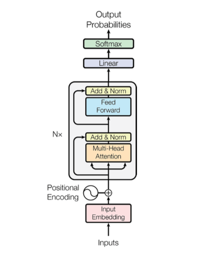

# **Clinical Trial Matching Using BioClinicalBERT and RAG-Enhanced Retrieval**
## **Introduction**
In recent years, the growth of biomedical research has led to an explosion of clinical trials with increasingly complex eligibility criteria. Identifying the most suitable trial for a patient is a critical but challenging task for clinicians and researchers. The process involves analyzing detailed patient data—including diagnoses, treatment histories, and clinical notes—and matching them with trial descriptions that are often long, unstructured, and written in free text.  

Traditional approaches rely on keyword-based search or rule-based filters, which fail to understand the nuanced semantics of medical language. These methods are not only time-consuming and error-prone but also struggle to scale across large, diverse trial datasets.  
 
To address these challenges, this project proposes an intelligent clinical trial matching system that combines advanced natural language processing (NLP) and information retrieval techniques. The system leverages BioClinicalBERT, a domain-specific language model fine-tuned on clinical text, to semantically encode patient queries and trial descriptions into dense vector representations. Using FAISS (Facebook AI Similarity Search), these embeddings are indexed to enable fast and scalable retrieval of the most relevant trials.  

Further enhancing the system, a Retrieval-Augmented Generation (RAG) pipeline with Flan-T5 generates human-readable explanations for each recommendation, improving interpretability and clinician trust. Additionally, a custom explainability module highlights the most relevant attributes from both the patient profile and trial description, offering deeper insights into the decision-making process.  

This approach enables accurate, efficient, and transparent clinical trial matching, supporting personalized patient care and advancing medical research.  

## **Problem Statement**
Matching patients to appropriate clinical trials is a critical step in advancing medical research and personalized treatment. However, this process is currently manual, time-consuming, and prone to errors. The unstructured nature of eligibility criteria and the complexity of patient records make automated matching challenging. Existing keyword-based systems fail to capture nuanced medical semantics, leading to low accuracy and poor scalability.

## **Objective**

1.To design a semantic, scalable, and explainable system for clinical trial matching.  
2.To improve the accuracy of patient-trial recommendations using domain-specific embeddings.  
3.To enable interpretability through natural language justifications, fostering clinician trust.  

## **Architecture**

  

The proposed system is built upon a bi-encoder architecture that semantically matches patient queries to clinical trial descriptions. At the core of this system lies the BioClinicalBERT model, a transformer-based language model fine-tuned on large-scale clinical datasets such as MIMIC-III. BioClinicalBERT enables the extraction of deep semantic representations from unstructured clinical text, effectively capturing the nuanced relationships between patient profiles and trial eligibility criteria. The encoding process leverages the [CLS] token output from the final hidden layer to generate a dense, fixed-size vector embedding for each input text. The overall architecture of BERT, used as the foundational model in this work, is illustrated in Figure 1 below.  

Once patient queries and trial descriptions are transformed into embeddings, the system utilizes FAISS (Facebook AI Similarity Search) to perform efficient approximate nearest neighbor (ANN) retrieval. By precomputing and indexing all trial embeddings offline, the system ensures scalable and rapid similarity search even across large databases. When a new patient query is received, it is encoded in real-time and compared against the indexed trial embeddings using cosine similarity. The top-k most relevant trials are then retrieved and ranked based on their similarity scores.  

To improve interpretability and clinician trust, the architecture integrates a Retrieval-Augmented Generation (RAG) module based on Flan-T5. This lightweight generative model generates natural language explanations that justify why each trial is recommended for a specific patient, providing clear and human-understandable rationales. Additionally, an explainability module highlights the most significant tokens or features within both the patient query and the trial text that contributed to the final matching decision.  

This comprehensive architecture combines semantic language understanding, scalable retrieval, and transparent explainability, resulting in a robust and clinically meaningful trial matching system.  

## **Methodology**
The proposed clinical trial matching system is designed to accurately pair patient queries with relevant clinical trials by leveraging advanced natural language processing and retrieval techniques. The core idea revolves around transforming unstructured clinical text into semantically meaningful vector representations, enabling efficient and precise similarity-based matching.

The process begins with data preprocessing, where both patient records and clinical trial documents are cleaned and standardized. This involves lowercasing, removal of punctuation and extraneous whitespace, and concatenating important trial fields such as the official title, summary, and eligibility criteria. These prepared texts are then fed into BioClinicalBERT, a domain-specific language model fine-tuned on clinical corpora. BioClinicalBERT encodes each document into a dense semantic embedding, using the output of the [CLS] token to capture the contextual meaning of the entire text.

Once the embeddings for clinical trials are generated, they are precomputed and stored in a FAISS index to support scalable and fast approximate nearest neighbor (ANN) retrieval. When a new patient query is submitted, it is encoded using the same BioClinicalBERT model to produce a corresponding embedding. This patient embedding is then compared against all pre-indexed trial embeddings using cosine similarity, and the top-k most relevant clinical trials are retrieved based on similarity scores.

To enhance the interpretability of recommendations, the system incorporates a Retrieval-Augmented Generation (RAG) module using Flan-T5. This lightweight generative model takes the retrieved trial texts and produces human-readable explanations that justify each recommendation, providing clinicians and patients with clear, understandable reasons for each match. Additionally, an explainability module highlights the most relevant tokens or sections in both the patient and trial documents, offering further transparency into the model’s decision-making process.

The complete workflow of this system — from query processing and embedding generation to retrieval and explanation — is illustrated in Figure 2 below. This methodology ensures not only high matching accuracy but also efficient scalability and enhanced trust through interpretable outputs.

  

## **Results**

  

To evaluate the effectiveness of the proposed clinical trial matching system, extensive experiments were conducted using the publicly available TREC Clinical Trial Matching datasets (2021–2022). These datasets simulate realistic patient queries and trial eligibility descriptions, providing a robust testbed for assessing real-world performance. Each patient-trial pair is labeled with a binary indicator reflecting suitability, allowing for precise quantitative evaluation.  

The system achieved a final test accuracy of 81.48%, with a best validation accuracy of 79.63%. The final test loss and best validation loss were reported as 0.4311 and 0.4548, respectively, demonstrating stable and effective learning throughout training.  

A detailed breakdown of the model's performance in terms of precision, recall, and F1-score further highlights its robustness. For Class 0 (non-matching pairs), the system achieved a precision of 0.84, recall of 0.92, and an F1-score of 0.88. For Class 1 (matching pairs), it achieved even stronger results, with a precision of 0.93, recall of 0.86, and an F1-score of 0.89. The overall classification report yielded an accuracy of 88%, confirming the model's ability to correctly identify both relevant and irrelevant trials across diverse scenarios.  

In addition to numerical performance, the integration of FAISS indexing significantly improved retrieval efficiency, enabling real-time approximate nearest neighbor search even with large-scale trial data. The system’s capacity to handle thousands of trials while maintaining high accuracy demonstrates its potential for practical deployment in clinical environments.  

Furthermore, the incorporation of the RAG module with Flan-T5 provided human-readable justifications for each recommendation, enhancing interpretability and trust among clinicians. The explainability module, which highlights important tokens and text segments, offered deeper insights into the reasoning behind each match, facilitating clinician validation and increasing overall system transparency.  

Collectively, these results validate the system’s effectiveness, scalability, and readiness for real-world clinical trial matching applications.  

## **Conclusion**
The proposed clinical trial matching system successfully addresses the challenges of accurately pairing patients with suitable clinical trials in a scalable and interpretable manner. By integrating BioClinicalBERT for domain-specific semantic understanding, the system effectively captures the nuanced relationships between unstructured patient data and complex trial eligibility criteria. The use of FAISS indexing enables efficient and rapid retrieval of relevant trials, ensuring the system can operate in real-time even when handling large-scale datasets.

Beyond mere accuracy, the incorporation of a Retrieval-Augmented Generation (RAG) module using Flan-T5 represents a significant advancement in system interpretability. The generation of human-readable explanations provides clinicians and patients with clear rationales for each recommendation, fostering greater trust and supporting informed decision-making. The additional explainability module further enhances transparency by highlighting key features that influenced the final match, making the entire process more understandable and verifiable.

Overall, this system demonstrates strong potential for integration into clinical workflows, supporting patient recruitment and personalized treatment selection. Its combination of high accuracy, scalability, and transparent reasoning positions it as a practical, impactful solution for the future of AI-assisted clinical trial matching.

## **Future Scope**
While the current system shows promising results in terms of accuracy, efficiency, and interpretability, there are several directions for future enhancement to make it even more robust and widely applicable.

One important future improvement is the integration of more advanced generative models for explanation, potentially using larger or more specialized versions of language models to produce even more detailed and contextually rich rationales. Additionally, incorporating visual explainability tools such as SHAP or LIME could provide clinicians with intuitive graphical representations of which features or tokens most influenced each recommendation.

Expanding support for multilingual and multi-regional trial data is another crucial step. By enabling the system to handle clinical texts in multiple languages, it can be adapted for global use, improving access to clinical trials for diverse patient populations.

From a deployment perspective, developing a user-friendly web or mobile application interface will make the system more accessible to clinicians and patients in real-world settings. Integration with electronic health record (EHR) systems and hospital information systems would further streamline workflows and facilitate seamless patient-trial matching directly within existing clinical environments.

Finally, adopting modern vector databases and more advanced retrieval techniques could enhance scalability, enabling real-time matching even as the number of clinical trials and patient queries continues to grow. These improvements will collectively transform the current prototype into a practical, trustworthy, and widely deployable clinical decision-support tool.
